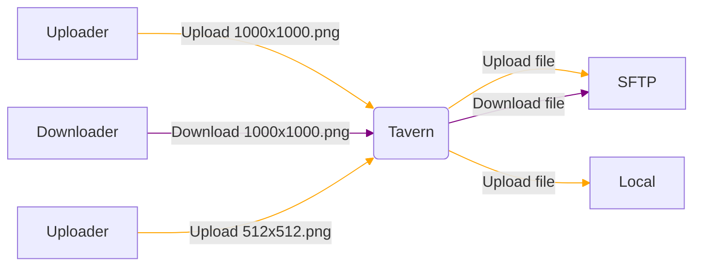

# Tavern
Tavern is one of the easiest solutions for uploading files from the web or your other projects. Simply fill out your .env and run your executable :)

Supporting multiple storage options (local & SFTP) and multiple databases (sqlite & mysql/mariaDB) and more to follow.

Wanna see how to set it up? Read more below!

## How does it work?
Tavern exposes a HTTP server on port 8080, which is responsible for either retrieving files from the buckets or sending them to the buckets while executing some SQL queries.

## Setting up:
With these X easy steps you can have a file tavern of your own!
1. Download the executable from the releases (W.I.P, for now you have to build it yourself)
2. Grab the .env example from the git and save it in a folder you'll remember.
3. Fill out the .env example with your setup
4. Run `tavern encryption:generate` to get your encryption key
5. Run `tavern database:migrate` to setup your database structure
6. Run `tavern daemon:start` to start the webserver.

## Adding a new storage "bucket"
Using `tavern bucket:drivers` you can view the drivers that you are able to use. 
Then by simply using `tavern bucket:create` you can fill out the prompts to get your bucket online, this will also immediatly allow uploads to this bucket.

## Adding API keys
API keys are used for authenticating with your bucket, an API key can be easily generated with `tavern key:generate`, this will return your API key.

## The docs
the docs are available at https://tavern-gg.github.io (W.I.P)

## Supporting the creator

